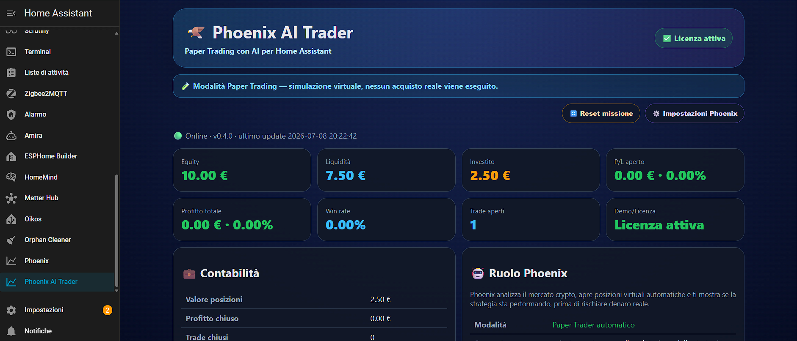

<div align="center">


# 🦅 Phoenix AI Trader

### Paper Trading con AI per Home Assistant

**Simula il tuo portafoglio crypto. Monitora guadagni e perdite. Impara senza rischiare denaro reale.**


[](https://my.home-assistant.io/redirect/hacs_repository/?owner=PakyITA&repository=phoenix-ai-trader&category=integration)

**🇬🇧 Documentazione inglese:** [README.md](README.md)

---

**Phoenix AI Trader** porta un'esperienza premium di **Paper Trading** direttamente dentro **Home Assistant**.

Puoi creare un portafoglio crypto virtuale, monitorare guadagni e perdite, ricevere alert Telegram e seguire una missione personale sul capitale — senza collegarti a un exchange e senza rischiare denaro reale.

> ⚠️ **Phoenix AI Trader è progettato esclusivamente per il Paper Trading.**
>
> Non si collega a Binance, Bybit, Coinbase o altri exchange e non esegue ordini reali.

</div>

---

## 🚀 Come funziona Phoenix

1. Installa Phoenix da HACS.
2. Completa il wizard di configurazione.
3. Usa la demo gratuita completa per 24 ore.
4. Dopo la demo, Phoenix richiede una licenza personale annuale.
5. Acquista la licenza tramite PayPal.
6. Ricevi la licenza firmata via email.
7. Incolla la licenza in **Phoenix AI Trader → Configura** oppure nella pagina impostazioni interna di Phoenix.

---

## 🔑 Demo gratuita e licenza annuale

Phoenix AI Trader include una **demo gratuita di 24 ore**.

Alla scadenza della demo, dashboard principale e sensori del portafoglio vengono bloccati fino all'inserimento di una licenza valida.

Le licenze Phoenix sono **annuali**. Una licenza valida sblocca Phoenix per **12 mesi dalla data di emissione**. Al termine del periodo annuale, la licenza deve essere rinnovata per continuare a usare le funzioni premium.

### 💥 Offerta lancio

Per i primi **15 giorni**, la licenza personale annuale Phoenix AI Trader è disponibile a:

```text
9,99 € invece di 19,99 €
```

Al termine dell'offerta lancio, il prezzo standard della licenza annuale sarà **19,99 €**.

Le licenze sono:

- annuali e valide per 12 mesi dalla data di emissione
- legate all'email PayPal dell'acquirente
- personali e non trasferibili
- valide per una installazione Home Assistant
- verificate localmente tramite licenza offline firmata

Per acquistare una licenza, contatta lo sviluppatore dopo l'installazione oppure segui le istruzioni PayPal mostrate nella dashboard Phoenix alla scadenza della demo.

---

## ✨ Cosa rende Phoenix diverso

| | |
|---|---|
| 🧠 **AI Paper Trading** | Simula un portafoglio crypto e testa idee senza rischiare denaro reale |
| 📊 **Dashboard Home Assistant** | Monitora equity, liquidità, posizioni aperte, profit/loss e missione |
| 📱 **Alert Telegram** | Ricevi avvisi quando guadagni o perdite simulate superano le soglie impostate |
| 🎯 **Mission Mode** | Imposta capitale iniziale, capitale obiettivo e durata della missione |
| 🏠 **Entità native** | Usa sensori e binary sensor in dashboard, script e automazioni |
| 🔐 **Demo 24h + licenza annuale** | Prova Phoenix, poi sbloccalo con una licenza personale annuale firmata |
| 🧩 **Zero YAML** | Configurazione completa dal wizard Home Assistant |

---

## 📊 Anteprima dashboard

Phoenix include un pannello laterale dedicato dentro Home Assistant con:

- 💰 valore portafoglio
- 📈 equity
- 📉 profitto / perdita
- 🎯 avanzamento missione
- 🏆 migliori opportunità
- 📊 win rate
- 🪙 loghi delle criptovalute
- 🧠 AI score
- 🔐 stato demo / licenza

<p align="center">
  
</p>

---

## 🏠 Entità Home Assistant

Phoenix crea entità native Home Assistant come:

### Sensori

- Equity
- Liquidità
- Capitale investito
- Valore posizioni aperte
- Profitto / perdita aperta
- Profitto totale
- Profitto percentuale
- Win rate
- Trade aperti
- Trade chiusi
- Top cryptocurrency
- Ultimo aggiornamento
- Stato licenza
- Tempo demo residuo

### Binary sensor

- Licenza attiva
- Demo attiva
- Phoenix bloccato
- Telegram attivo

Queste entità possono essere usate in dashboard, automazioni, script e notifiche.

---

## ⚙️ Wizard di configurazione

Dopo l'installazione, configura Phoenix da:

```text
Impostazioni → Dispositivi e servizi → Aggiungi integrazione → Phoenix AI Trader
```

Durante il wizard puoi configurare:

- cartella dati
- capitale iniziale
- capitale obiettivo
- durata della missione
- email
- codice di attivazione opzionale
- notifiche Telegram opzionali
- servizio notify Telegram di Home Assistant, per esempio `notify.telegram`
- Telegram Chat ID / target opzionale
- soglia alert guadagno / perdita in euro
- soglia alert guadagno / perdita in percentuale
- tempo minimo tra un alert e l'altro

Non è richiesta configurazione YAML manuale per Phoenix.

> 📱 **Requisito Telegram:** Phoenix non crea e non configura automaticamente il bot Telegram. Per ricevere gli alert Telegram devi prima configurare un servizio `notify` Telegram funzionante in Home Assistant, poi inserire in Phoenix il nome del servizio e, quando richiesto dalla tua configurazione Home Assistant, anche il Telegram Chat ID.

---

## 🧾 Modifica licenza o impostazioni

Phoenix supporta il pulsante **Configura** di Home Assistant e una pagina impostazioni interna.

Vai su:

```text
Impostazioni → Dispositivi e servizi → Phoenix AI Trader → Configura
```

oppure apri:

```text
Phoenix AI Trader → Impostazioni Phoenix
```

Da qui puoi modificare:

- email licenza
- codice attivazione
- notifiche Telegram
- servizio notify Telegram
- Telegram Chat ID / target
- soglie alert
- impostazioni missione

---

## 📱 Notifiche Telegram — configurazione completa

Phoenix può inviare avvisi tramite un servizio `notify` di Home Assistant quando il portafoglio simulato raggiunge una soglia configurata di guadagno o perdita.

Phoenix **non crea il bot Telegram** e **non configura automaticamente l'integrazione Telegram di Home Assistant**. Telegram deve già funzionare in Home Assistant prima che Phoenix possa usarlo.

### 1. Configura prima Telegram in Home Assistant

Prima di abilitare Telegram in Phoenix, assicurati che Home Assistant abbia già un servizio Telegram funzionante.

Esempi tipici:

```text
notify.telegram
notify.telegram_bot
notify.pasquale
```

Il nome preciso dipende dalla tua configurazione Home Assistant.

### 2. Trova il nome corretto del servizio notify

In Home Assistant apri:

```text
Strumenti per sviluppatori → Servizi
```

Cerca:

```text
notify.
```

Poi individua il servizio Telegram che usi normalmente per inviare messaggi.

Phoenix deve ricevere il nome completo del servizio, incluso `notify.`.

Esempio:

```text
notify.telegram
```

### 3. Trova il tuo Telegram Chat ID

Alcune configurazioni Telegram di Home Assistant hanno già un destinatario predefinito. In quel caso Phoenix può inviare il messaggio usando solo `message`.

Altre configurazioni richiedono anche il destinatario. In quel caso Phoenix deve ricevere anche il **Telegram Chat ID**.

Il Chat ID può essere simile a:

```text
123456789
```

oppure, per gruppi e canali, può essere simile a:

```text
-1001234567890
```

Di solito puoi trovarlo:

- nella configurazione Telegram già presente in Home Assistant
- nella configurazione del bot Telegram
- nei log di Home Assistant quando il bot riceve un messaggio
- usando un bot/strumento Telegram dedicato alla lettura del proprio chat ID

### 4. Inserisci i dati in Phoenix

Apri:

```text
Phoenix AI Trader → Impostazioni Phoenix
```

Compila:

```text
Telegram attivo: Sì
Servizio Telegram: notify.telegram
Telegram Chat ID opzionale: il tuo chat_id
```

Se il tuo servizio `notify.telegram` ha già un destinatario fisso configurato, puoi lasciare vuoto il campo Chat ID.

### 5. Salva e testa

Clicca:

```text
Salva impostazioni
```

Poi clicca:

```text
Test Telegram
```

Phoenix invierà questo messaggio:

```text
Test Telegram Passato
```

Se il campo Chat ID è compilato, Phoenix invia:

```yaml
message: "Test Telegram Passato"
target: "il_tuo_chat_id"
```

Se il campo Chat ID è vuoto, Phoenix invia solo:

```yaml
message: "Test Telegram Passato"
```

### 6. Se il test Telegram non funziona

Controlla questi punti:

1. Verifica che il bot Telegram funzioni già fuori da Phoenix.
2. Vai in **Strumenti per sviluppatori → Servizi** e prova manualmente il servizio `notify.telegram`.
3. Controlla che il nome del servizio inserito in Phoenix sia identico a quello di Home Assistant.
4. Se il servizio richiede un destinatario, inserisci il Telegram Chat ID in Phoenix.
5. Controlla i log di Home Assistant cercando errori relativi a `phoenix`, `telegram` o `notify`.
6. Dopo l'aggiornamento di Phoenix, riavvia Home Assistant.

Comando utile dal terminale di Home Assistant:

```bash
ha core logs | grep -i phoenix
```

---

## 📦 Installazione con HACS

### Metodo 1 — Aggiungi a Home Assistant

Clicca il badge **Aggiungi a Home Assistant** in alto in questo README.

### Metodo 2 — Repository custom manuale

1. Apri HACS
2. Vai su **Integrazioni**
3. Aggiungi questo repository come custom repository
4. Seleziona categoria **Integration**
5. Installa **Phoenix AI Trader**
6. Riavvia Home Assistant
7. Vai su **Impostazioni → Dispositivi e servizi**
8. Aggiungi **Phoenix AI Trader**
9. Completa il wizard

---

## 📁 Cartella dati predefinita

```text
/config/phoenix-ai-trader-ha
```

L'integrazione genera automaticamente tutti i file necessari dentro questa cartella.

---

## 🔒 Sicurezza

Phoenix AI Trader è **100% Paper Trading**.

Phoenix:

✅ non si collega a Binance  
✅ non si collega a Bybit  
✅ non si collega a Coinbase  
✅ non esegue trade reali  
✅ non gestisce fondi reali  
✅ non richiede API key di exchange  

Tutto viene simulato localmente dentro Home Assistant.

---

## ⚠️ Disclaimer finanziario e responsabilità

Phoenix AI Trader è uno strumento di **simulazione, studio e Paper Trading**. Non è un consulente finanziario, non fornisce raccomandazioni di investimento e non garantisce risultati economici.

Le informazioni, gli score, gli alert Telegram, le simulazioni e qualsiasi dato mostrato da Phoenix devono essere considerati esclusivamente a scopo informativo e didattico.

L'autore non è responsabile per:

- perdite di denaro reali
- decisioni di investimento prese dall'utente
- uso improprio del software
- interpretazioni errate dei dati
- danni diretti o indiretti derivanti dall'uso di Phoenix

L'utente è l'unico responsabile delle proprie decisioni finanziarie. Qualsiasi operazione reale sui mercati deve essere effettuata responsabilmente, consapevolmente e, se necessario, con il supporto di un professionista qualificato.

Phoenix AI Trader **non esegue trade reali**, **non gestisce fondi reali** e **non deve essere usato come sostituto di una consulenza finanziaria professionale**.

---

## 💬 Supporto

| | |
|---|---|
| 🐛 **Bug** | Apri una GitHub Issue |
| 💡 **Idee** | Usa GitHub Discussions o contatta lo sviluppatore |
| 🔑 **Licenza** | Licenza annuale · Offerta lancio: **9,99 € per 15 giorni**, poi **19,99 €/anno** · pagamento PayPal → licenza firmata via email |
| 📱 **Telegram** | Richiede un servizio `notify` Telegram già configurato in Home Assistant e può richiedere il Telegram Chat ID / target |
| 🇬🇧 **Supporto inglese** | Documentazione inglese disponibile in [README.md](README.md) |

---

## 📡 Funzioni previste

Le prossime versioni potrebbero includere:

- 📱 notifiche Telegram avanzate
- 📈 alert guadagno / perdita
- 🤖 assistente trading AI
- 📊 grafici interattivi
- 📄 report PDF
- 📈 confronto strategie
- 🧠 spiegazioni AI dei trade
- 🌍 supporto multi-portafoglio
- 📚 statistiche trading
- 📉 analisi storiche
- 🔐 backend licenze online

---

## 📜 Licenza

Phoenix AI Trader è software proprietario commerciale.

Una licenza annuale valida concede l'utilizzo personale e non trasferibile sulla propria istanza Home Assistant per 12 mesi dalla data di emissione.

Non è consentito redistribuire, rivendere, sublicenziare, pubblicare copie modificate o rendere il software disponibile a terzi senza autorizzazione scritta.

---

<div align="center">

## 🦅 Phoenix AI Trader

**Paper Trading con AI per Home Assistant.**

Creato con ❤️ da PakyITA.

</div>
